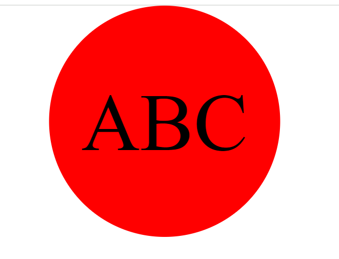

## Description 
GIVEN a note-taking application
WHEN I open the Note Taker
THEN I am presented with a landing page with a link to a notes page
WHEN I click on the link to the notes page
THEN I am presented with a page with existing notes listed in the left-hand column, plus empty fields to enter a new note title and the note’s text in the right-hand column
WHEN I enter a new note title and the note’s text
THEN a Save icon appears in the navigation at the top of the page
WHEN I click on the Save icon
THEN the new note I have entered is saved and appears in the left-hand column with the other existing notes
WHEN I click on an existing note in the list in the left-hand column
THEN that note appears in the right-hand column
WHEN I click on the Write icon in the navigation at the top of the page
THEN I am presented with empty fields to enter a new note title and the note’s text in the right-hand column

## Project URL
  https://github.com/csherman177/logoCraft   

## Deployment
  https://csherman177.github.io/logoCraft/

## Demo/Screenshots
  <table>
  <tr>
    <td>SVG Logo Generator Screenshot</td>
  </tr>
  <tr>
    <td></td>
  </tr>
  </table>

  <table>
  <tr>
    <td>SVG Logo Generator Video</td>
  </tr>
  <tr>
    <td></td>
  </tr>
  </table>
 
  ## Contact
  Email: csherman177@gmail.com

  ## Author
  Author(s): Courtney Sherman 
  GitHub: https://github.com/csherman177/ 